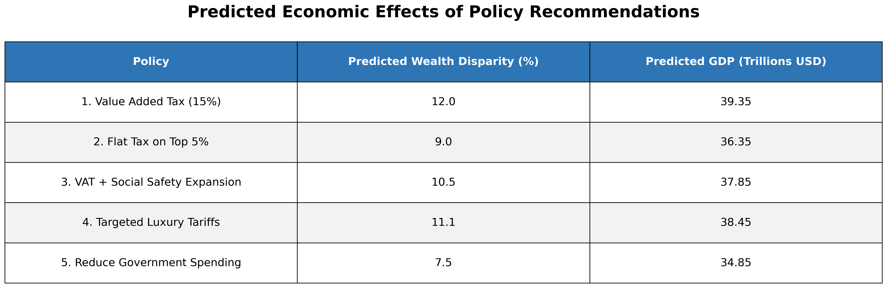

# 📊 Policy Memo Final Project — Public Policy Analysis  

This repository contains a comprehensive analysis of **GDP**, **GDP Per Capita**, and **Wealth Disparity** in response to different **fiscal and trade policy shifts**, such as tax cuts and tariff increases. Using elasticity-based economic modeling, this project simulates and visualizes outcomes under various policy scenarios.  

This is a **reanalysis** of the original MATLAB repository, now fully developed in Python and supplemented by a final policy memo.

---

## 🧾 Final Report  
📄 **[Policy Memo Part 4 (Final) George Johnson.pdf](./Policy%20Memo%20Part%204%20(Final)%20George%20Johnson.pdf)**  
This document is the final write-up for the project, summarizing the results, methodology, and policy implications in a concise, professional memo format.

---

## ✨ Abstract  

> This project explores how economic policy shifts—specifically **tax cuts** and **tariff increases**—affect gross domestic product (GDP), GDP per capita, and wealth inequality in the United States. Using elasticity-based modeling, the analysis simulates changes under various policy scenarios to evaluate both economic growth and distributional outcomes. While modest shifts stimulate GDP growth, the findings reveal a consistent trend of rising wealth concentration among the top 10%, especially as policy changes grow more extreme. The results highlight the **trade-offs between economic expansion and equity**, offering insights for policymakers and analysts alike.

---

## 🗂️ Files in This Repository  

| File | Description |
|------|-------------|
| `Policy Memo Part 4.ipynb` |  Final Python notebook for simulation, visualization, and analysis |
| `Policy Memo Part 3 Code,R` |  Original R script used in Part 3 (early stage) |
| `change_in_GDP.png` |  Visualization of GDP change vs. policy shift |
| `change_in_GDP_per_capita.png` |  GDP per capita as a function of policy shift |
| `change_in_wealth_disparity.png` |  Wealth disparity growth with increasing policy shift |
| `wealth_disparity_probability_table.png` |  Table quantifying probability of inequality increase |
| `policy_predictions_table.png` |  Policy scenario table showing predicted impacts |
| `George J Policy Memo 4.png` |  Final draft of memo (PNG form) |
| `README.md` |  This file |

---

## 🧪 Methodology  

The analysis is based on the following key components:

-  **GDP Elasticity Model**  
  GDP is a function of elasticity across **consumption**, **investment**, and **government spending**:
  \[
  GDP(θ) = GDP_{\text{current}} \times (1 + \text{Elasticity} \times θ)
  \]

-  **Wealth Disparity Modeling**  
  Modeled as proportional growth in top 10% share based on overall shift intensity.

-  **Policy Shift Definition**  
  Combined influence of **tax rate change (ΔT)** and **tariff increase (ΔTariff)** is modeled as a single shift parameter θ.

-  **Libraries Used**  
  - `NumPy`, `Pandas` — numerical processing  
  - `Matplotlib` — plotting and tables  

---

## 📊 Visual Findings  

### 🟦 GDP Change  

-  **Tax cut (2%)** and **tariff increase (25%)** both result in increased GDP.  
-  However, benefits are **not equitably distributed**.

---

### 🟨 GDP Per Capita  

- GDP per capita grows steadily with increasing θ.  
- Real income gains, however, depend on **distribution**.

---

### 🟥 Wealth Disparity  

- Wealth concentration among the top 10% **rises in all cases**.  
- Suggests policies may widen inequality even as GDP grows.

---

### 🟫 Probability of Inequality Increase  

- At small policy shifts (θ < 3%), only a **50% chance** of increased inequality.  
- Beyond θ = 6%, the probability spikes to **80–100%**.

---

### 🟪 Predicted Policy Outcomes  

- Scenarios such as **"Trump Plan"** and **"Targeted Luxury Tariffs"** yield high GDP but also high inequality.  
- Balanced options like **"VAT + Social Safety Expansion"** offer more moderate outcomes.

---

## 🧷 Summary Table  

| ✅ Policy Effect | 📌 Explanation |
|-----------------|----------------|
| **Tax cuts increase GDP but worsen inequality** | High earners see larger relative benefits |
| **Tariffs raise GDP per capita** | Boosts domestic production but raises prices |
| **Inequality grows sharply with policy magnitude** | Disparity becomes almost certain with θ > 9% |

---

## 🧠 Policy Implications  

This project provides a flexible modeling framework to assess **real-world trade-offs** in public policy. It allows decision-makers to:

- Simulate fiscal or trade policies
- Evaluate impacts on GDP and inequality
- Compare distributional consequences of popular plans

---

## 📎 Citation  
> Johnson, George. *Policy Memo: Fiscal and Trade Policy Impact Analysis* (2025). Public Policy Final Project, Python Reanalysis.

