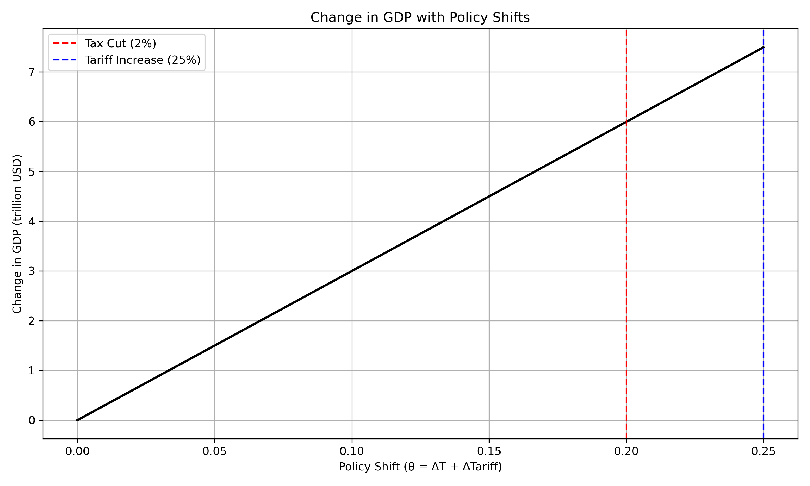
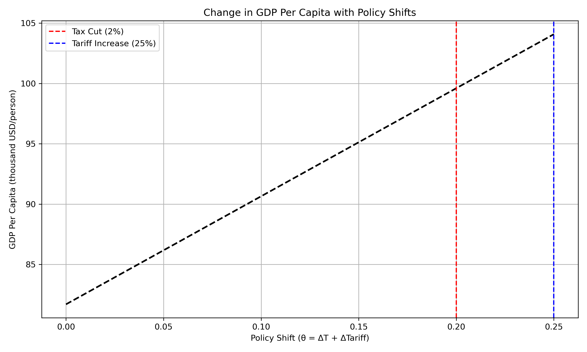
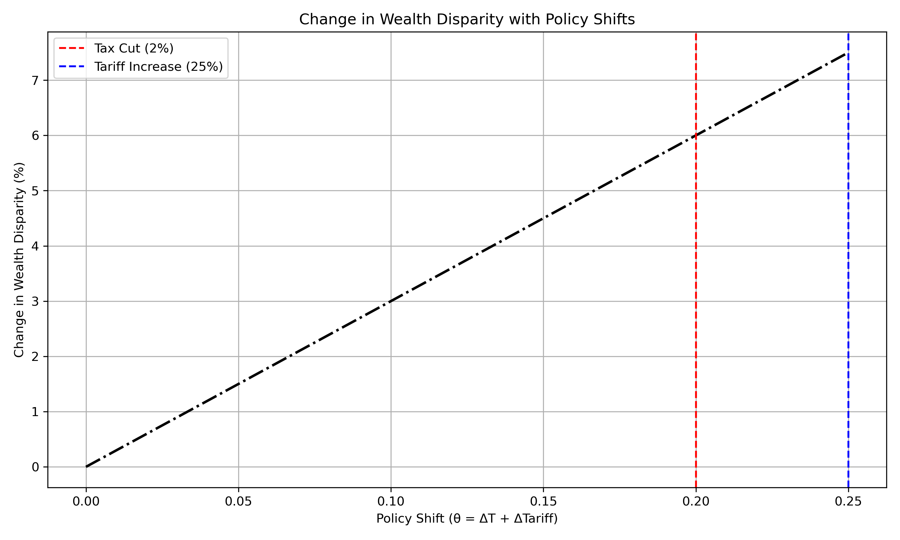
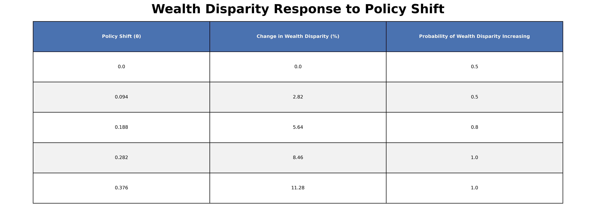

# 📊 Policy Memo Final Project - Public Policy Analysis

This repository contains an analysis of **GDP, GDP Per Capita, and Wealth Disparity** in response to different **policy shifts** such as **tax cuts** and **tariff increases**. The study uses economic elasticity models to simulate possible outcomes.
- This is a reanlysis of the MATLAB repository

---

 **Abstract**  
>  
> This project explores how economic policy shifts—specifically tax cuts and tariff increases—affect gross domestic product (GDP), GDP per capita, and wealth inequality in the United States. Using elasticity-based modeling, the analysis simulates changes under various policy scenarios to evaluate both economic growth and distributional outcomes. While modest shifts stimulate GDP growth, the findings reveal a consistent trend of rising wealth concentration among the top 10%, especially as policy changes grow more extreme. The results highlight the trade-offs between economic expansion and equitable distribution, offering insights for policymakers, economists, and analysts seeking to understand the long-term effects of fiscal and trade interventions.

---
## 📁 Files in This Repository 

- All the PNG files are different writing stages of the Project with  **`George J Policy Memo 4.png`  being the final version**
- `change_in_GDP.png` - 📈 Change in GDP with Policy Shifts  
- `change_in_GDP_per_capita.png` - 💰 Change in GDP Per Capita  
- `change_in_wealth_disparity.png` - 🔀 Change in Wealth Disparity  
- `wealth_disparity_probability_table.png` - 📋 Probability Table for Wealth Disparity Increase
- `Policy Memo Part 3 Code` - 📝 R Script original that was originally used for part 3 later went to python
- `Policy Memo Part 4.pynb` - 📝 Python script used for data processing and visualization  
- `README.md` - 📘 You’re reading it now!  

---

## 📖 Methodology  
The analysis is based on the following key factors:  
✅ **GDP Elasticity**: Influenced by consumption, investment, and government spending.  
✅ **Wealth Disparity Elasticity**: Modeled using proportional changes in wealth concentration.  
✅ **Policy Shift Variables**: Includes changes in tax rates and tariff percentages.  

The dataset is generated using **Python (NumPy, Pandas, Matplotlib)** to calculate and visualize the effects of different policy adjustments.  

---

## 📊 Visualizations & Findings  

### 🔹 Change in GDP with Policy Shifts  

  

  

**📌 Interpretation**  
- A **2% tax cut** leads to a noticeable **increase in GDP**.
- A **25% tariff increase** also boosts GDP under this model.
- However, these gains are **not evenly distributed**—GDP may grow, but who benefits is the key question.

**🧠 Why it matters**  
- Tax cuts typically boost investment and spending, but the benefits often **concentrate among higher-income groups**.
- Tariffs can **stimulate domestic production** but may **raise costs** elsewhere in the economy.

---

### 🔹 Change in GDP Per Capita with Policy Shifts  

  

  

**📌 Interpretation**  
- Both tax cuts and tariff increases show an **upward trend in GDP per capita**.
- GDP per capita rises steadily with the degree of policy change.

**🧠 Why it matters**  
- While this suggests more economic output per person, it doesn’t mean **everyone’s income rises equally**.
- The **distribution of that growth** is crucial for understanding real-world impact.

---

### 🔹 Change in Wealth Disparity with Policy Shifts  

  

  

**📌 Interpretation**  
- Wealth disparity increases **consistently** as policy shifts grow.
- The 2% tax cut and 25% tariff both correspond to **increased wealth for the top 10%**.

**🧠 Why it matters**  
- This means that while GDP is rising, the **wealth gap is widening**.
- Policies favoring growth can sometimes **intensify inequality**, depending on how gains are distributed.

---

### 🔹 Wealth Disparity Probability Table  

  

  

**📌 Interpretation**  
- When policy shifts are small (<3%), there’s only a **50% chance** wealth disparity will increase.  
- At **6% shift**, the chance rises to **80%**.
- At **>9%**, disparity almost certainly rises (**100% probability**).

**🧠 Why it matters**  
- This quantifies the **likelihood** that inequality increases as policies become more extreme.
- It provides a **risk framework** for decision-makers concerned about equity impacts.

## 📌Summary of Key Takeaways  
| 🔹 Finding | 📌 Explanation |
|------------|--------------|
| **Tax cuts boost GDP but increase wealth disparity** | High earners benefit the most, widening the income gap. |
| **Tariff increases raise GDP per capita** | Protectionism supports domestic industries but may increase consumer prices. |
| **Wealth disparity rises significantly with strong policy shifts** | If shifts exceed 6%, the wealth gap almost certainly increases. |
